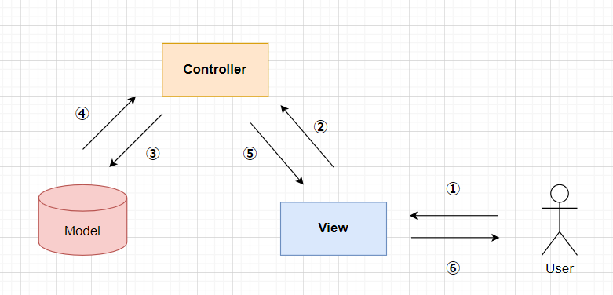

# 概要
Fletでデスクトップアプリを作るためのMVCテンプレートです。<br>

# 設計思想
 - MVCアーキテクチャを採用
 - SPAとして動作

## MVCとは？
 システム開発においての設計方針の一つで「Model」　「View」　「Controller」の3つに分けてコードを管理する構成です。<br><br>
 **イメージ図**
 
 それぞれのクラスが疎結合な関係、依存度を少なくすることで、コードの修正による、他の影響を少なくできるメリットがあります。また役割によってクラスを分ける事により可読性も高くなります。<br>

## SPAとは？
 シングルページアプリケーションの略で、全てのページで共通で使用したい場所はそのまま残してページによって切り替えたい箇所のみを更新するUI生成方法です。

## ディレクトリ構成
このテンプレートのモジュール構成は下記のようになっています。
```python
src
 ├── common_widgets
 │   ├── app_layout.py
 │   ├── app_layout_bk.py
 │   ├── header.py
 │   └── sidebar.py
 ├── controllers.py
 ├── main.py
 ├── models.py
 ├── storage    # ←実行時に自動生成されるフォルダ     
 │   ├── data
 │   └── temp
 └── views.py
```
